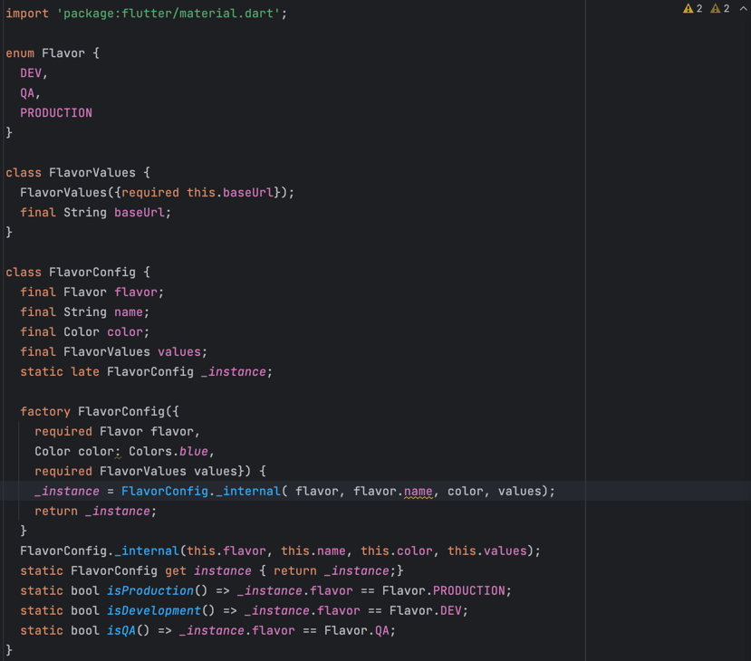
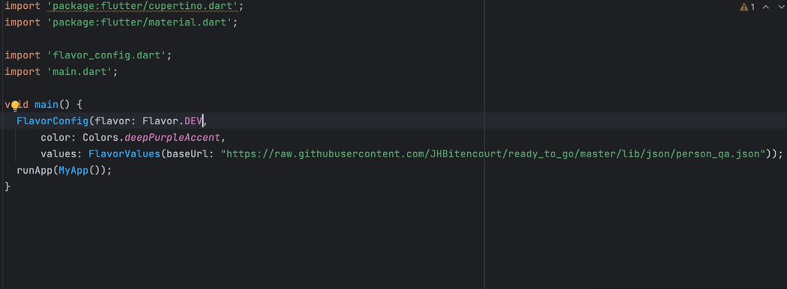
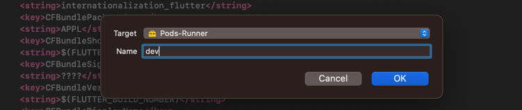
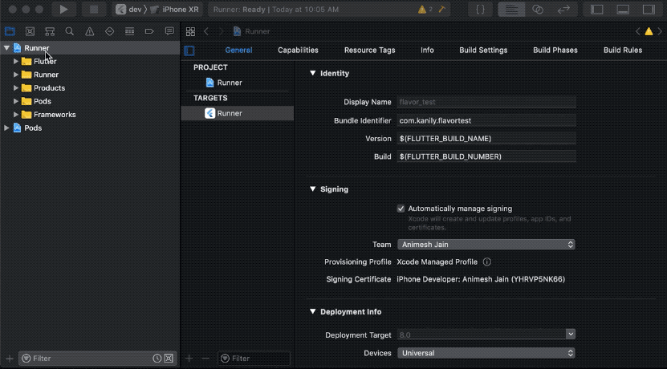
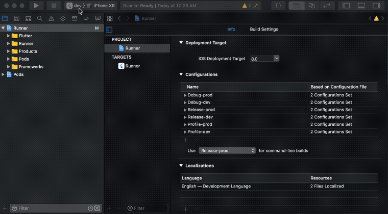
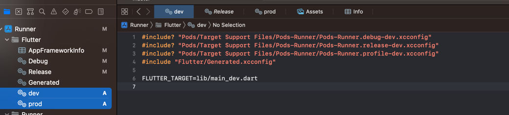
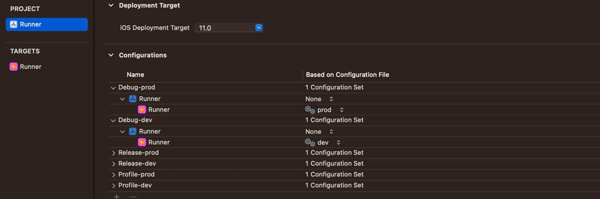

# Flavors in Flutter

-> Create flavor configuration file

-> Create main.dart file for each flavors

-> Run app by following command from cmd
   flutter run --flavor <flavors name> -t <flavors main.dart file name>(for example: lib/main_dev.dart)

## Android Configuration:
-> Adding build flavors to Android
 

## IOS Configuration:  
-> Add custom schemes
 

-> Add configurations for new added schemes

-> Manage new added schemes

-> Added .xcconfig file for each new scheme

-> Config new created .xcconfig file in build configuration

For reference:
https://medium.com/@animeshjain/build-flavors-in-flutter-android-and-ios-with-different-firebase-projects-per-flavor-27c5c5dac10b

   
